# Modelling the US fentanyl epidemic: a tool for policy intervention

## Abstract
With a great acceleration of deaths by fentanyl overdose during the CoVid-19 pandemic, the United States are battling against synthetic opioids being smuggled inside the country and its dramatic consequences. By trying to understand the dynamics driving the fentanyl epidemic in the United States using a compartmental model, precious insights could be provided to policymakers to counter the social and economic effects illicit drugs have on the country as a whole.

Official data show that fentanyl-related overdose deaths have spiked after 2012. According to our model, the main parameters impacting this concerning increase are the extremely high prescription opioids addiction rates, the loose recovery rate and, of course, the deadliness of fentanyl (being 50 times more potent than heroin). Tailor-made policies should account for the sensitivity of the fentanyl epidemic system to these factors, trying not to focus on a prohibitionist approach. In fact, drug seizures and bans should be applied with care: a restrictive policy might even increase the number of fentanyl deaths by overdose in the long run.

## 1. Introduction
Fentanyl, an illicit synthetic opioid, is becoming a public health threat in the US. According to the 2020 National Drug Threat Assessment, the use of cheap and highly potent fentanyl has increased throughout the period 2019-2020 [4]. Provisional data released by the CDC in 2020 also suggest an acceleration of deaths by fentanyl overdose during the CoVid-19 pandemic [30], with 10 western states reporting over a 98 percent increase in synthetic opioid-involved deaths.

Since October 2017, the US Department of Health and Human Services has declared the opioid crisis a public health emergency [13].

To stop the alarming surge in deaths, the US government has adopted a number of intervention policies starting from the early 2000s. Solutions such as the Merida Initiative [41], the increase of boarder patrol agents [19] and the coordinated effort of DEA and the Chinese government [11] have moderately curbed the fentanyl epidemic, without having a substantial impact at the global level.

In this paper we try to model the fentanyl epidemic by making use of a compartmental model. Our aim is to understand the main drivers behind the current trend displayed by the US fentanyl epidemic in order to be able to propose more effective policy interventions. With the conviction that a simple yet precise epidemic model could help us gain relevant insights, this work is meant to shift the focus towards powerful solutions the US government can adopt in the time to come.

The first section of this paper aims at providing a general background with regards to the fentanyl phenomenon that has been affecting the United States in the past decades. Insightful compartmental models of drug epidemics are also mentioned, together with analyses of fentanyl chemical structure and more recent official reports describing the American opioid epidemic. Lastly, we present the general methods used to complete our computational analysis.

In the Model section, our carefully-designed SHFR model is outlined and justified through an accurate description of the processes governing the movement of individuals within a simple compartmental system.

The third and fourth section are meant to provide the reader with a descriptive analysis of the data used to carry out the simulation and the simulation itself, respectively. By conducting an assessment of the parameters sensitivity, meaningful insights can be gained and intervention policies can be formulated in a more efficient way.

Finally, the Discussion section contains possible avenues for future work, based on the analysis performed in this paper. This last section is also the bridge linking the intuitions obtained through modelling this complex system and policy interventions that governments should adopt.

## 2. Background
### (a) Fentanyl
Proposed as an alternative to morphine, which was first isolated in its pure form between 1803 and 1817 [24], fentanyl has been used as an intravenous analgesic since late 1970s. Starting from the 1990s, fentanyl and fentanyl analogs have been found in heroin batches in the United States [20], and from 2005 the US have seen an alarming surge in fentanyl-related deaths traced to fentanyl-laced heroin sold to unsuspecting heroin users [12]. Dramatic increases in fentanyl encounters were seen again in both 2014 and 2015 [28, 26], with surges in overdose deaths due to illicitly produced fentanyl [32] imported mainly from Mexico and China [4].

Fentanyl, like similar drugs, produces µ-opioid central nervous system actions such as fatigue, sedation, nausea, vomiting, dizziness, respiratory depression, bradycardia and unconsciousness in higher doses irrespective of the mode of administration [17]. Being 75 to 100 times more potent than morphine and about 50 times stronger than heroin [39], plasma concentrations above 3 ng/mL can be fatal in most cases [27].

Difficulties encountered when trying to detect the presence of fentanyl and fentanyl analogs contribute to the high morbidity and mortality they are characterized by. When fentanyl overdose is detected, naloxone (a µ-opioid receptor antagonist) is administered to reverse central and peripheral effects caused by excessive intakes of opioids [38].

### (b) Litterature review
Different papers have been written about compartmental models of generic drug epidemics [10, 37, 44] and heroin diffusion processes [34]. Despite being an useful point to start from, these studies focus on processes that cannot be applied to the novel fentanyl epidemic in the United States. Fentanyl’s addictive power and deadliness make it impossible to compare it to other illicit drugs such as marijuana, heroin, cocaine and methamphetamines. Moreover, fentanyl’s dependence does not result from a gradual transition from prescription opioids or prescription fentanyl specifically [32]. For this reason, models such as the one proposed by Battista et al. [9] can still be considered relevant as they faithfully represent opioid addiction in the US from a mathematical perspective, but are not enough to account for the peculiarity of the fentanyl’s phenomenon. Despite illicit fentanyl epidemics have not been analyzed under a computational perspective so far, fentanyl case has not gone unnoticed. Its history [38] and its chemical properties [8], together with major trends in fentanyl abuse [33, 35, 14, 21, 36, 22] demonstrate that this worrying topic has been widely discussed from many different perspectives.

### (c) Methods
To better understand the drivers behind the fentanyl epidemic in the US and try to provide meaningful policy insights, simple analysis methods have been used.

Both simulation and calibration have been carried out using Python (a renowned programming language) and its integrate module (belonging to SciPy) over the governmental data gathered as explained in Section 4. On the other hand, results and sensitivity analysis have been performed with the help of Uncertainpy, a Python toolbox using Sobol sensitivity indices for uncertainty quantification [42].

## 3. Model
To study the evolution of the fentanyl epidemic in the United States and be able to understand the drivers behind the trend in fentanyl deaths, we consider a dynamic compartmental model. Starting from Kermack and McKendrick’s idea of SIR compartmental model [23], according to which epidemics might be modelled by dividing the population into different compartments and letting individuals pass between them according to specific parameters, we decided to approach the fentanyl epidemic under a similar computational perspective. We start by dividing the population into four different compartments, namely Susceptible, Heroin users, Fentanyl users and Recovered and model the transition between compartments according to specific parameters, as shown in Figure 1.

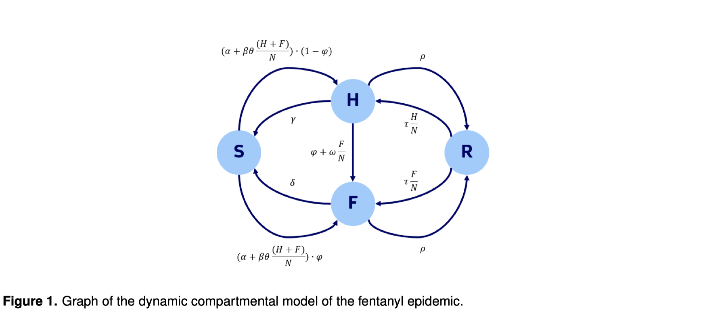

The dynamics governing the transition between compartments are represented by the differential equation set in 3.1.

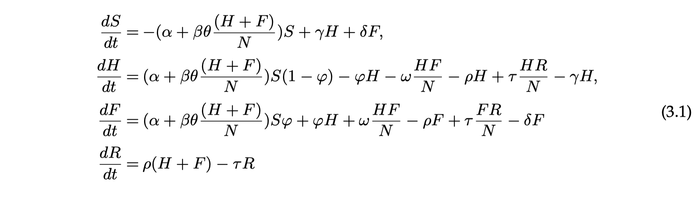

Differently from other drug epidemic models, individuals are not allowed to get back to the Susceptible compartment once they enter the Heroin or the Fentanyl compartments. This assumption arises from the fact that dependency from opioids might be considered as a chronic illness: completion rates of detoxification programs are very low and levels of relapse post treatment are high [25]. Within the population dynamic, we consider a time-invariant demographic trend. Births make up for overdose deaths (parametrized by γ and δ), and population is assumed to be constant.

Regarding the Fentanyl and Heroin compartments, an additional assumption has been made: the Fentanyl compartment absorbs each and every individual that is currently consuming at least fentanyl, independently of the awareness of the party and of the other drugs she is taking. This consideration is key, as it is difficult to attribute death by overdose to a unique substance [33].

The third important assumption is that no individual passes from the Susceptible compartment to the Fentanyl one in a voluntary way. This assumption is captured by the parameter φ, which is the probability of heroin (or other drugs) being cut with fentanyl. This parameter is also a primary driver of the movement from the Heroin compartment to the Fentanyl one. Together with parameter φ, taking into account the unaware movements from heroin to fentanyl, parameter ω is considered for the transition from the Heroin to the Fentanyl compartment. This parameter is the net conversion rate from heroin to fentanyl and addresses those cases in which aware fentanyl users reach heroin users who might in turn start using fentanyl and enter the Fentanyl compartment.

Three crucial components determining the movement outside of the Susceptible compartment are α, β and θ. Similarly to Battista’s paper [9], α accounts for users developing an addiction to prescription opioids and looking for something more potent than prescription drugs to satisfy their needs. Parameter β is the rate governing the possibility of becoming addicted once in contact with the market for illegal drugs, and interacts with θ, a parameter that keeps track of opioid availability on such market.

As a general observation related to the dynamics underlying the movement between compartments, it is important to highlight the fact that drug users do not always know what they are buying: the drug market is unregulated and illicit, and people have extremely asymmetric information [22]. The laced rate parameter (i.e., φ) is specified to range from a small to a greater fraction of a dose: as a cheap synthetic drug, fentanyl is preferred to many other alternatives when lacing heroin. It is expressed as a function of the ratio of fentanyl users over heroin users. This ratio is meant to represent the demand of fentanyl on the market: the more fentanyl is demanded compared to heroin, the more suppliers tend to lace heroin with fentanyl to satisfy the request [4].

Finally, transition from the Fentanyl and Heroin compartments to the Recovered compartment (and vice-versa) is regulated by parameters ρ (the recovery rate) and τ (the relapse rate), respectively. The latter interacts with the fraction of fentanyl and heroin users, to account for increases in the probability of relapse when heroin and fentanyl users make up a greater fraction of the population.

## 4. Data
To better understand the fentanyl epidemic phenomenon, data related to fentanyl-, heroin- and prescription opioid-related overdose deaths in the US have been retrieved for the period 19992019 from the CDC database [5]. These data, representing the number of deaths attributed to each of the three substances over 100,000 individuals, are shown in Figure 2.

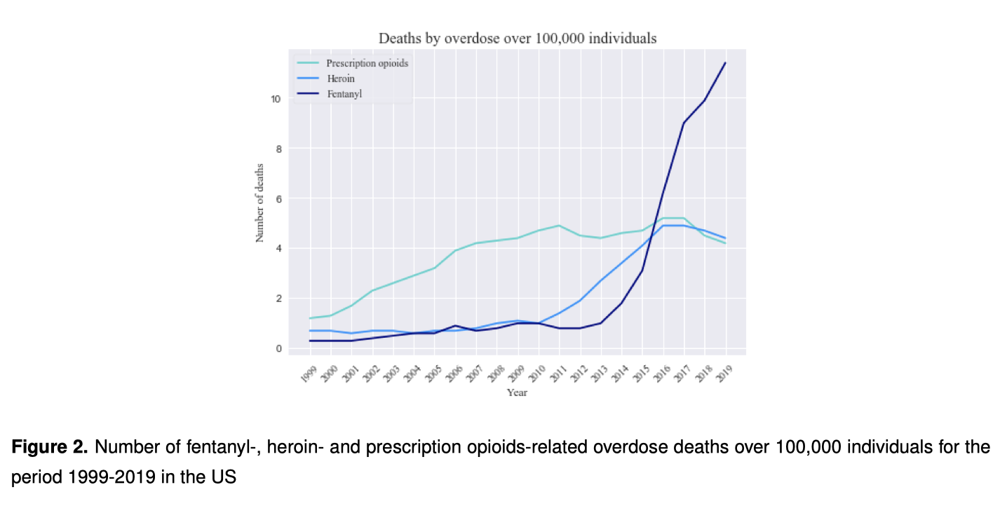

As it can be seen from Figure 2, heroin deaths started to increase since the early 2010s. Despite growing earlier than fentanyl overdose deaths, the latter grew with a steep exponential tendency starting from 2013. In fact, deaths caused by fentanyl overdose increased by about 450% over the period 2014-2019. While in 2016 fentanyl continued to increase, heroin started to marginally decrease. Finally, for the whole 20-years period in consideration, prescription opioid deaths were stable, averaging over 3.5 deaths for each 100,000 individuals in the US.

### (a) Model parametrization
As far as model parametrization is concerned, Table 1 provides a summary of the parameters used to characterize the movement between compartments, and their initialization values.

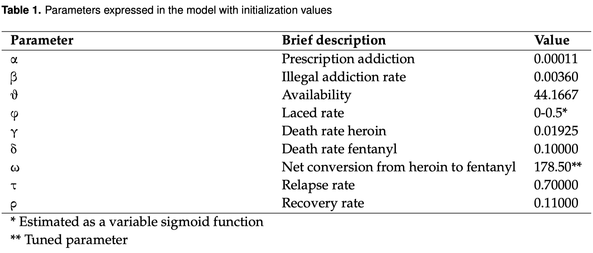

As mentioned in Section 3, parameters α, β, θ and φ are the main drivers behind the movement outside the Susceptible compartment. Both α and β are taken from the literature [9]: the former is scaled for a constant accounting for the fraction of prescription opioid users actually switching to illegal opioids, and the latter is set to 0.0036 and can be seen as the probability of a Susceptible starting to use drugs as a consequence of an interaction with Fentanyl and Heroin users. To design the model in a more realistic way, β is always scaled by the parameter θ (i.e. the drug availability ratio). Parameter θ is obtained using seizure statistics from the period 2000-2020 [18,2] and accounts for the increase in the supply of opioids over time (see Appendix, Section 6): the greater the availability of opioids, the more likely it is for an individual to come into contact with them. The fourth and last parameter governing the movement outside the Susceptible compartment is φ (i.e. the lacing rate), and is built using official data released by DEA [2, 3]. The lacing rate is assumed to be a function of the ratio of consumption of fentanyl and consumption of heroin: the more fentanyl is consumed, the more its availability increases following an expansion in demand, the greater the probability that heroin is cut with fentanyl. Calculations can be found in the Appendix (Section 6), where φ is expressed as a sigmoid function with stable lower and upper asymptotes set at 0 and 0.50, respectively.

As far as parameters γ and δ are concerned, data were needed to extract reliable values for both heroin and fentanyl mortality rate among users. While heroin mortality rate was extracted as the ratio of heroin-related overdose deaths and the number of heroin users in the US in 2019 [5], fentanyl mortality rate was retrieved by comparing drug seizures and using them as a proxy. Assuming that the ratio of heroin seizure and fentanyl seizure is proportional to the ratio of the number of heroin users and the number of fentanyl users, fentanyl death rate is estimated to be equal to the product of the number of deaths caused by fentanyl overdose [5] and the inverse of the number of fentanyl users as proxied by assumption. Using fentanyl seizures statistics for 2019 [16], the estimated fentanyl death rate is 0.10. More specifically, fentanyl is estimated to be deadlier than heroin by a factor of 5.19, as heroin death rate (among users) is approximately 0.02.

Finally, the recovery rate and the relapse rate (namely, ρ and τ) are assumed to be equal to 0.11 and 0.7, respectively [9]. Due to unavailability of data to create a reliable proxy, they are taken to be the same for fentanyl and heroin. For this reason, sensitivity analysis has been performed to check for the impact of these variables.

## 5. Results
To get relevant output for the Results section, a preliminary tuning step has been taken in order to find the most suitable ω (i.e. the net conversion from heroin to fentanyl). This step translates into computing the residual sum of squares for different values of the net conversion rate and then pick the value of ω associated with the lowest error for the fitting. In particular, given the differential equations specified in Section 3, we initialized the model with the set of prespecified parameters and a given number of individuals inside each compartment (taken to be the estimated initial number of users and susceptible individuals), and then observed the values simulated over time. The initial values of the parameters can be seen in Subsection (a) of the Data section, while the initial number of heroin and fentanyl users are obtained as specified in Section 3 when expressing γ and δ (i.e. the mortality rates for heroin and fentanyl, respectively).

### (a) First model
We first take into consideration the 20-years period as a whole. Following the tuning routine mentioned in the Result section, the value of ω that best minimize the global error is 178.5. In this case, RSS provided by the fitting routine are 181 and 176 for heroin and fentanyl, respectively. As it can be seen from Figure 3, the value minimizing the global error is very close to the individual error, highlighting coherence in the model. Using the mean values for the Heroin and Fentanyl compartment in the simulated data (i.e. 182.2 and 16.8 individuals out of 100,000 people, respectively), we can understand the average contribution of each channel.

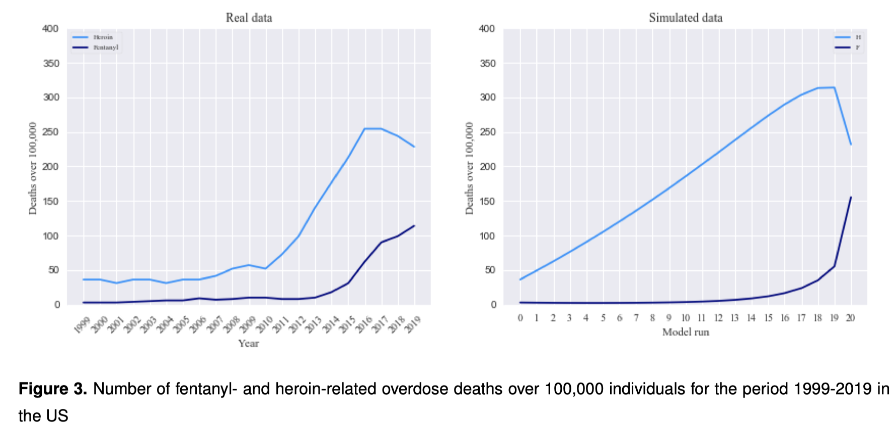

In particular, given the estimated conversion rate ω and the average number of people belonging to each compartment, an average of 5.46 individuals transitioned yearly from heroin to fentanyl in a voluntary way. This specific transition is not the biggest channel bringing people to the Fentanyl compartment: the proportion of people entering F is dominated by individuals that buy heroin laced with fentanyl without them being aware of it, especially when the laced rate φ gets closer to 50%.

### (b) Second model with time
When running the model as a whole for the time period 1999-2020, we used an average value for the availability θ (see Section 6). Despite the good fit (when plotting the real and simulated data showed in Figure 3), it was possible to see that both time-series had a first part in which their trend was flat and a second part in which the trend turned to be exponential.

To create a better fit and take into account this break point in time, we assumed that availability θ changed between the two time periods (from 1999 to 2010 and from 2011 to 2020). While in the first piece of the model it is assumed to be equal to 1, in the second part θ is the estimated rate of fentanyl and heroin supply on the market, as we believed that the different behaviour in the two regions of the graph can be explained by a different supply of illegal opioids in the relative time periods.

The estimation procedure is unchanged. Regarding the hyper-parameter, the global minima are close to the specific heroin and fentanyl minima in both cases. The net conversion ω takes value 185.5 in the rising part of the graph and 419.5 in the flat region. The different values convey the different role played by the voluntary conversion from heroin to fentanyl in different time frames, associated with different availability values. Results for the first and the second time periods can be observed in Figure 4 and Figure 5.

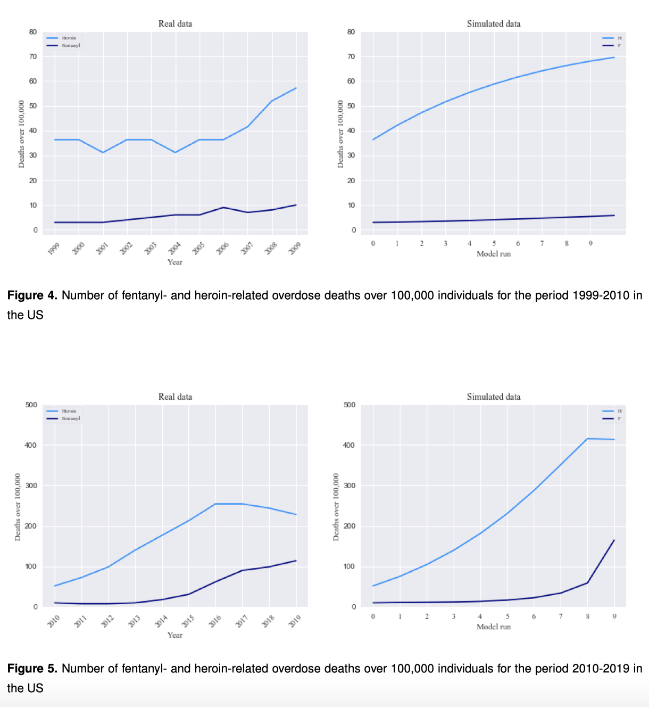

### (c) Sensitivity Analysis
To be able to understand how the model reacts to changes in parameters, sensitivity analysis has been performed over the most uncertain variables: the addiction to prescription opioids (α), the recovery rate (ρ), the relapse rate (τ) and the death rate of fentanyl (δ).

To explore the model sensitivity, Normal and Uniform distributions were chosen to allow the uncertain parameter to range between different values.

More specifically, we chose the parameters we wanted to analyse and tried to understand its contribution to the variance for each of the four compartments. In doing this, we kept all the other parameters fixed, changing just the one of interest. Behind this intuitive decision, the assumption is that the parameter we are changing does not affect the others. Finally, we plotted the trend in each of the four compartments, together with their variance (generated from the varying value of the uncertain parameter). To get this output, we chose a prediction interval of 90%.

#### (i) Prescription addiction
Prescription addiction α is a parameter for which which we decided to assign a Uniform distribution in an interval U[0.05 · 0.001116, 0.2 · 0.001116]. In particular, the original value from the literature for α was 0.001116 but we add a re-scaling element 0.1 multiplying the previous one. As a result, the Uniform range was U[0.05, 0.20].

As it can be seen from Figure 6, S has a decreasing trend. Its variance increase until the last year. Compartment H has an increasing behaviour until the 15th year in consideration, and then decreases. F has an increasing behaviour and a relevant variance, particularly towards the end of the analysis. R has an increasing trend with a variance that always rising when the year increase.

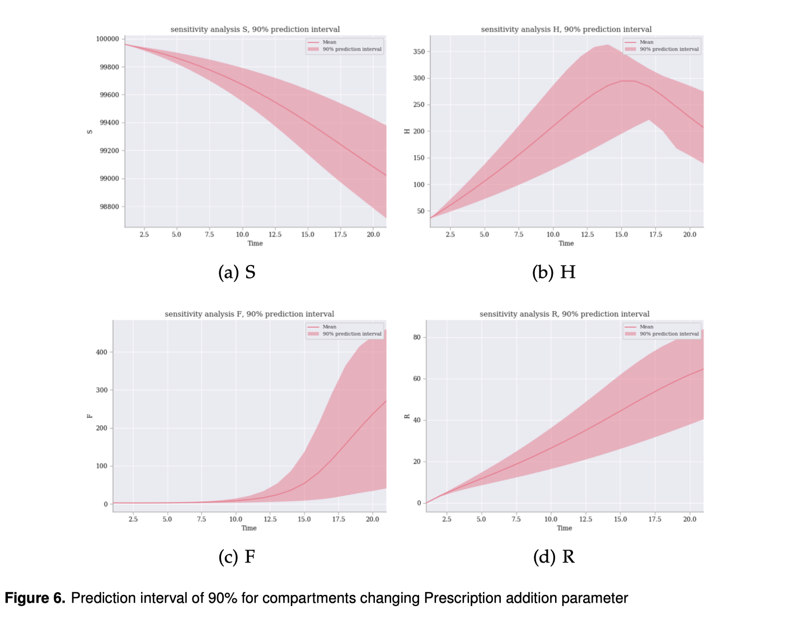

#### (ii) Recovery rate
We assumed ρ to have a Normal distribution N(µ = 0.1, σ 2 = 0.04 2 ), and the output can be seen in Figure 7.

As a result to the sensitivity analysis, S had high variability in the last years while remaining stable until the 10th year. The H compartment had low variability at the beginning and became wiggly at the end. Then, F had null variance until 2012 and then exploded. In this case, the impact of the Recovery rate is extremely high.

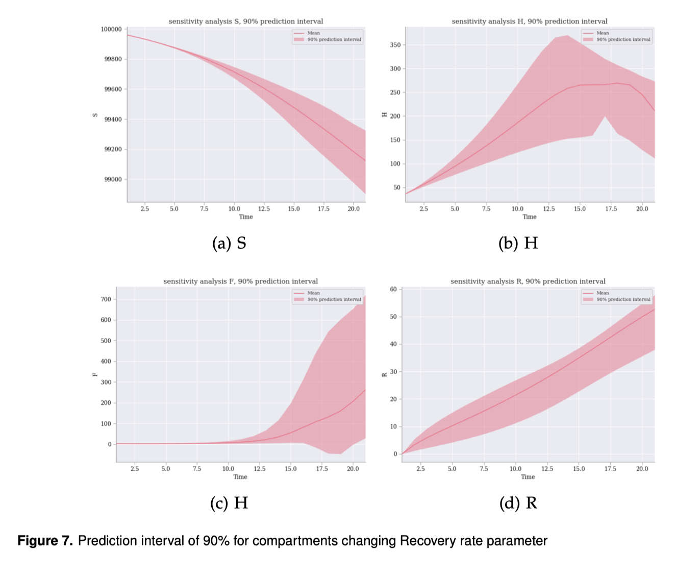

#### (iii) Replapse rate
Similarly to the recovery rate, the relapse rate (τ) had a Normal distribution of the form N(µ = 0.7, σ 2 = 0.05 2 ).

As it can be seen from Figure 8, for the S, H and F compartment, the relapse rate did not seem to affect the movement. On the other hand, the parameter weakly affected the Recovered compartment when varying.

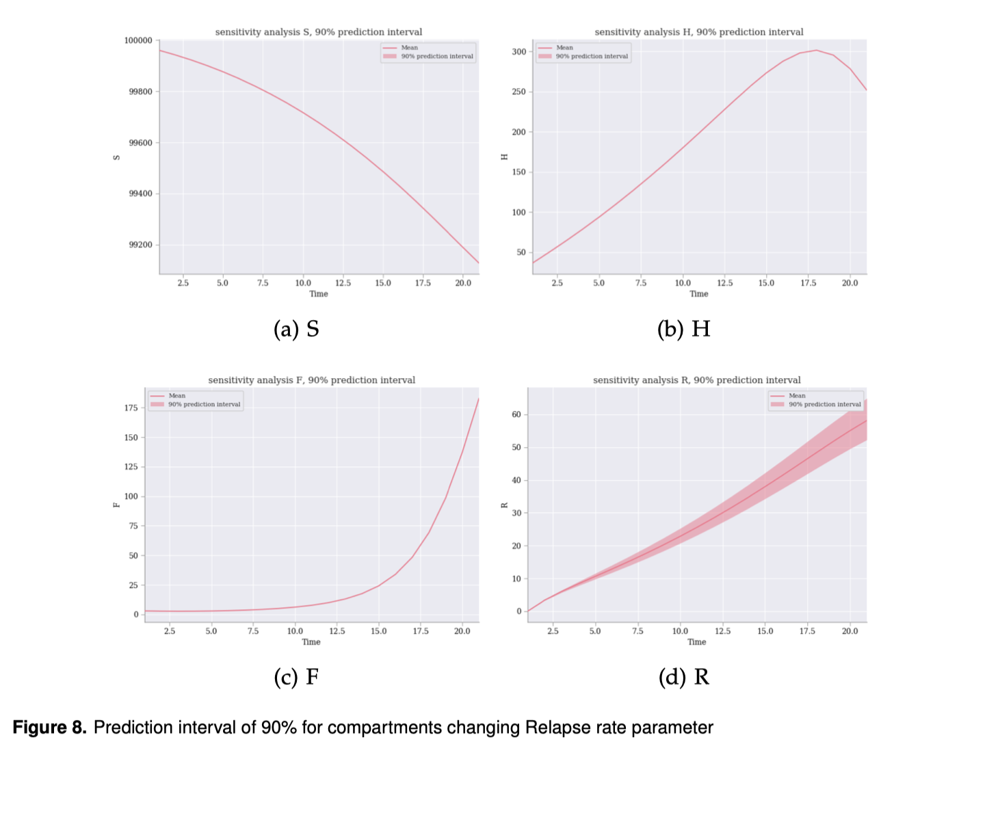

#### (iv) Death rate fentanyl
Fentanyl death rate has been assumed to be normally distributed (N(µ = 0.1, σ 2 = 0.005 2 )). In this way, the parameter could fall inside the interval [0.9 , 0.11].

The effect of the deadliness of fentanyl did not display a relevant impact over any of the four compartments. Results can be seen in Figure 9.

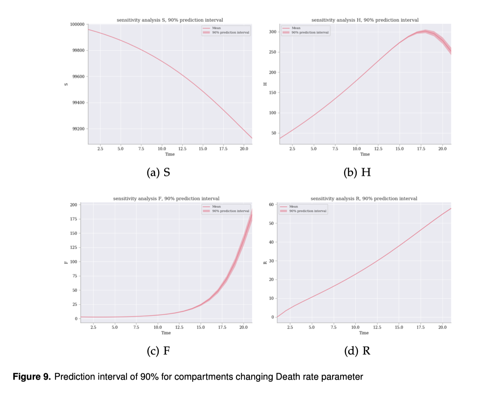

### (d) Policy analysis
Using the results and the insights gained from the model and the sensitivity analysis, as well as the vast literature on the opioid epidemic crisis, we wanted to suggest a different approach to the one currently undertaken by the United States, as well as many other countries. Despite this sub-section is not meant to be an exhaustive policy advice, it contains observations and ideas, as well as personal opinions, that we as researchers came up with working on this paper.

The aim of policy intervention should be to reduce fatalities and improve the quality of life of addicts. In our view, setting a goal based on the welfare of society is more important (and effective) than just reasoning in terms of seizures and reducing the availability of opioids down to zero.

It appears clear from our analysis that the best way to solve the opioid epidemic is to reduce the number of people currently addicted to illegal opioids like heroin and fentanyl. Specifically, illegal opioid addiction is associated with a greater mortality rate and addicts are more likely to be isolated from society compared to prescription opioids addicts [9]. The strategies to help people rely on two basic ideas: prevention of illegal opioid addiction and cure of illegal opioid addiction.

Campaigns to educate people, possibly already from a young age, about opioids and addiction would lead to great benefit [14]. In particular, our sensitivity analysis highlights the impact that a change of the addiction rate through prescription opioids (i.e., α) can have on the epidemic and we believe that proper education could help diminish the rate of people going from pills to heroin or fentanyl. Another aspect of prevention that we believe is important is the surveillance and control of the illegal marketplace. Examples includes border patrols and operations to seize big quantities of illegal drugs entering the country, as well as testing samples to anticipate possible future synthetic opioids trends and avoid them to explode in the same way as fentanyl did.

The prescription opioids market could be regulated in a better way. Prescription opioids are the gateway drug for opioid addiction, as about 80% of people addicted to illegal opioids first misused prescription opioids [9]. A conclusion is that limiting the supply of prescription opioids would end one of the main path of opioid addiction, leading to a future scenario similar to the one that can be seen in Figure 10 (b), where we simulated our model with a α parameter reduced by 50% of its initial value. A possible drawback of this intervention is that it could push prescription opioid users (taking pills for either medical or recreational reasons) towards heroin use. An hypothetical limitation to the supply of prescription opioids could increase (and not decrease) the addiction rate (in our model, α): the ban could backfire and cause an increase in addiction to illegal drugs in the short-term, while scenarios are hard to predict in the long-term. This projection, involving an increase in prescription opioid addiction, is showed in Figure 10 (c). In this case, fentanyl would reach an endemic equilibrium.

Curing the opioid epidemic is hard and by any means we are not handing the solution in the next paragraph, but throughout our research we noticed several things that could be improved, starting from collecting more data. The only way to improve something is to measure and understand it first, and this is not done with the vast majority of recovery programs in the United Sates. It is very hard to find statistics about the success rate of these programs and, in the few cases in which the data is actually collected, very few people’s progress is traced after they end the program. We believe that an improvement in the data collection process and effort in tracking recovered users after they finish the program, even years later, could bring very valuable insights on the epidemic. The last projected scenario plotted in Figure 10 (d) clearly shows this qualitative reasoning: increasing the recovery rate ρ by 100% would drastically reduce fentanyland heroin-related deaths in the year to come.

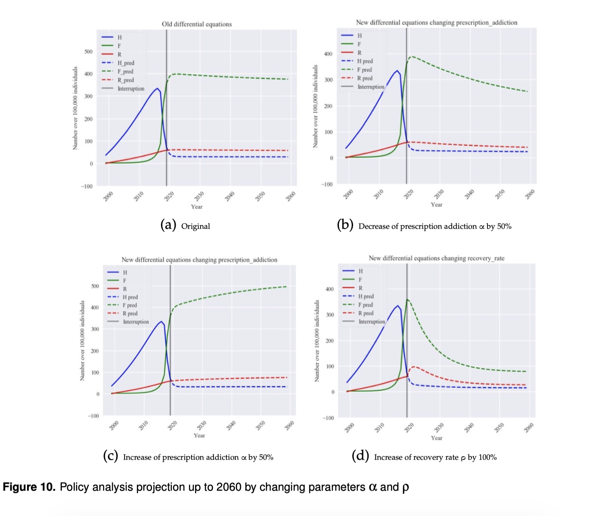

## 6. Conclusion
The model we suggested is able to capture important insights from the current opioid epidemic, characterized by the surge in synthetic opioids, among whose fentanyl is the major one. Our results show that a relatively simple compartmental model is able to simulate the surge in addiction rate and deaths over the past 20 years. In this regard, we believe that our model can be improved in several directions. As an example, when a lot of people switched from heroin to fentanyl, the simulated reduction in heroin users is greater than the one actually observed. A solution to this divergence could be the introduction of a feedback effect: as users move from heroin to fentanyl, maybe heroin becomes relatively cheaper or more available and it attracts back some Fentanyl users or new addicts. Another idea would be to take into account network of interactions that are more credible than a simple homogeneous mixing. Such an improvement could also aid policy intervention as it would take into account social dynamics as well.

As discussed extensively in this project, fentanyl is a worrying phenomenon, both under the economic and the social aspects. In this respect, policy intervention might be crucial to reverse the tendency in fentanyl consumption.

Reduction in opioids prescription and efforts in designing more suitable rehabilitation programs might be a good point to start from. Despite being simple, our model might provide governments (and, more specifically, the US executives) with valuable insights, also regarding the other parameters we took into consideration. Addiction is a very complex phenomenon: it is greatly affected by the social condition of the users, in the first place. A more thorough data collection procedure could help shed light on this problem.

Another crucial aspect for policy intervention is a shift in mentality. It is desirable to have a society in which drug abuse is not a problem, but this is likely not to be the case in the foreseeable future. By accepting the existence of a regulated opioid market (comprising prescription opioids or other opioids with lower risk of mortality), rather than pursuing a prohibition policy, the drug abuse problem would have better chances of being eradicated. As shown in the analysis, a prohibitionist policy could even end up incentivizing producers to come up with stronger versions of the drugs smuggled in a country, inevitably leading to a more dramatic crisis.

As far as future avenues for research are concerned, we believe that more specific analyses could be performed, supported by a more thorough data-collection process on the government side. This approach could also enrich the study of the fentanyl epidemic by building upon this simple yet powerful compartmental model. Using modelling techniques such as network analyses and ABMs would make it possible to account for the sociological and psychological perspectives, allowing spreading dynamics to be more predictable, and therefore easier to solve.

## Refernces
This section of the paper can be found in the PDF version of the paper in this repo.

## Appendix
This section of the paper can be found in the PDF version of the paper in this repo.
